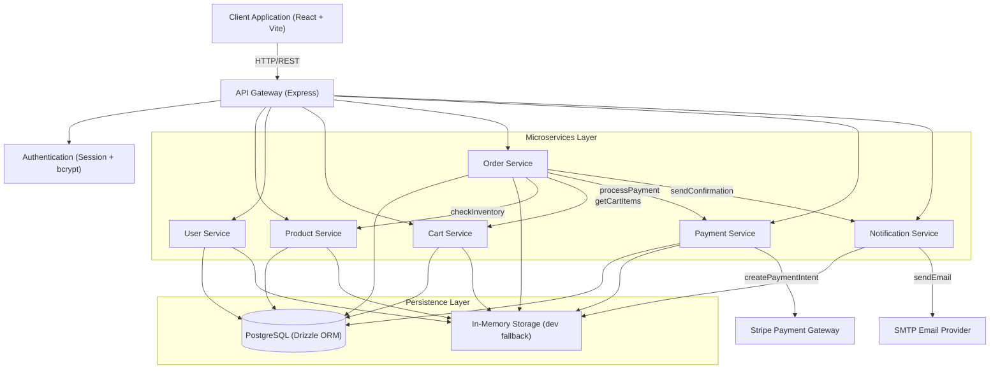
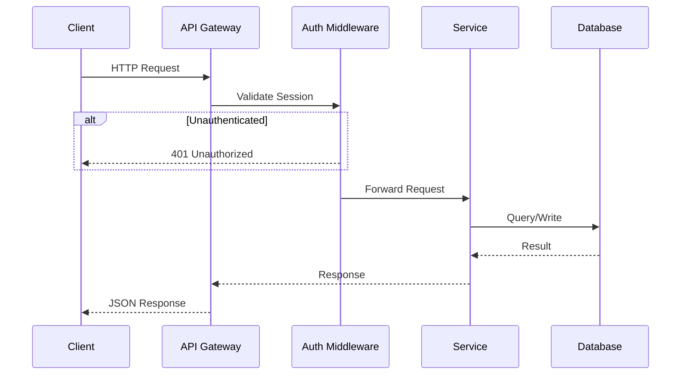
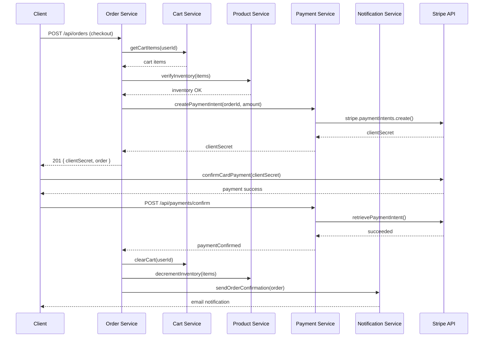

# System Architecture and Service Integrations

This document provides a visual representation of the microservices architecture and the integrations between different APIs in our e-commerce platform.

## System Architecture Diagram



## Request Lifecycle



## Checkout Flow



## Service Interaction and Data Flow

### User Purchase Flow

1. **User browses products**
   - Client app requests products from API Gateway
   - API Gateway routes to Product Service
   - Product Service returns product catalog

2. **User adds items to cart**
   - Client app sends cart updates to API Gateway
   - API Gateway routes to Cart Service
   - Cart Service updates cart and returns updated cart data

3. **User checks out**
   - Client app sends checkout request to API Gateway
   - API Gateway routes to Order Service
   - Order Service:
     - Creates a new order
     - Contacts Cart Service to get cart items
     - Contacts Product Service to verify inventory
     - Contacts Payment Service to process payment
   - Payment Service integrates with Stripe API
   - Upon successful payment:
     - Order Service updates order status
     - Notification Service sends order confirmation email
     - Cart Service clears the user's cart

## API Endpoints

### Product Service API

```
GET    /api/products          - List all products (with search, category, price, inStock filters)
GET    /api/products/:id      - Get product details
POST   /api/products          - Create new product (admin-only)
PUT    /api/products/:id      - Update product (admin-only)
DELETE /api/products/:id      - Delete product (admin-only)
```

### User Service API

```
POST   /api/auth/login        - User login (session-based)
POST   /api/auth/logout       - User logout
GET    /api/auth/me           - Get current session user
GET    /api/users             - List all users
GET    /api/users/:id         - Get user details (self or admin)
PUT    /api/users/:id/profile - Update user profile (self)
PUT    /api/users/:id/password- Change password (self)
POST   /api/users             - Create user
```

### Cart Service API

```
GET    /api/cart              - Get current user's cart
POST   /api/cart/items        - Add item to cart
PUT    /api/cart/items/:id    - Update cart item quantity
DELETE /api/cart/items/:id    - Remove item from cart
```

### Order Service API

```
POST   /api/orders            - Create new order from cart
GET    /api/orders            - List orders (admin: all, user: own)
GET    /api/orders/:id        - Get order details with items
PUT    /api/orders/:id/status - Update order status (admin-only)
```

### Payment Service API

```
GET    /api/payments/:id      - Get payment details
POST   /api/orders/:id/payment- Process payment for order
POST   /api/payments/create-intent  - Create Stripe payment intent
POST   /api/payments/confirm-intent - Confirm Stripe payment
POST   /api/payments/refund   - Refund payment
```

### Notification Service API

```
GET    /api/notifications     - Get user notifications
POST   /api/notifications/send - Send notification (admin-only)
PUT    /api/notifications/config/email - Update email config (admin-only)
```

### Gateway & Infrastructure

```
GET    /api/services/status   - List all service statuses
GET    /api/gateway/metrics   - System metrics (orders, users, revenue)
GET    /api/gateway/traffic   - API traffic statistics
GET    /api/gateway/containers - Docker container statuses
GET    /api/health            - Overall services health
```

## Database Schema

```mermaid
erDiagram
    users {
        int id PK
        text username UK
        text password
        text email UK
        text first_name
        text last_name
        boolean is_admin
    }
    products {
        int id PK
        text name
        text description
        float price
        text image_url
        text sku UK
        int inventory
        text category
    }
    carts {
        int id PK
        int user_id FK
        timestamp created_at
    }
    cart_items {
        int id PK
        int cart_id FK
        int product_id FK
        int quantity
    }
    orders {
        int id PK
        int user_id FK
        text status
        float total
        text shipping_address
        timestamp created_at
    }
    order_items {
        int id PK
        int order_id FK
        int product_id FK
        int quantity
        float price
    }
    payments {
        int id PK
        int order_id FK
        float amount
        text status
        text payment_method
        text transaction_id
        timestamp created_at
    }
    service_statuses {
        int id PK
        text name UK
        text status
        text details
        timestamp last_updated
    }

    users ||--o{ carts : has
    users ||--o{ orders : places
    carts ||--o{ cart_items : contains
    products ||--o{ cart_items : "added to"
    products ||--o{ order_items : "sold as"
    orders ||--o{ order_items : includes
    orders ||--o{ payments : has
```



## Inter-Service Communication

Services communicate with each other using typed service clients. Each service exposes an API that other services can consume:

- **Order Service -> Product Service**: Check product availability and decrement inventory
- **Order Service -> Cart Service**: Get cart items and clear cart after checkout
- **Order Service -> Payment Service**: Create payment intent and confirm payment
- **Order Service -> Notification Service**: Send order confirmation email

This approach provides a clean separation of concerns while still allowing services to work together to complete business processes.

## Architecture Decision Records

### ADR-001: Session-based Authentication over JWT

**Context**: Need to authenticate API requests for user-specific operations (cart, orders).

**Decision**: Use `express-session` with server-side session storage instead of JWT.

**Rationale**:
- Simpler token revocation (destroy server-side session)
- No token management on the client side
- Sufficient for a monolithic deployment with room to extract services

**Trade-offs**:
- Requires cookie-based auth (not ideal for mobile/third-party clients)
- Session store becomes a scaling concern (mitigated by `connect-pg-simple`)

### ADR-002: Storage Abstraction (IStorage Interface)

**Context**: Need to support both PostgreSQL and in-memory storage for development/testing.

**Decision**: Define `IStorage` interface with dual implementations (`PgStorage` and `MemStorage`).

**Rationale**:
- Enables unit testing without database dependency
- Development fallback when PostgreSQL is unavailable
- Clean interface makes it easy to swap storage backends

**Trade-offs**:
- Query optimization limited to lowest common denominator
- Storage interface must be manually kept in sync with schema changes

### ADR-003: Monorepo with Shared Schema

**Context**: Frontend and backend share types (Zod schemas, TypeScript types).

**Decision**: Use a shared workspace (`shared/`) with Drizzle ORM + drizzle-zod for single-source-of-truth validation.

**Rationale**:
- Zod schemas defined once, used for both API validation (server) and form validation (client)
- Drizzle's `$inferSelect` generates TypeScript types from table definitions
- Eliminates duplication between API contracts and frontend types

### ADR-004: Monolithic Deployment with Microservice Patterns

**Context**: Need architectural runway for future service extraction without premature complexity.

**Decision**: Deploy as a single Express process but organize code into service modules with service registry, health checks, and service clients.

**Rationale**:
- Easy to extract any service into its own process when needed
- Service registry provides discovery without hardcoded URLs
- Health check endpoints ready for orchestration

**Trade-offs**:
- In-process service calls add no network overhead (extraction will require adding latency)
- Shared global state (storage singleton) couples services at the data layer

## Infrastructure

### Service Discovery

The Service Discovery component allows services to find and communicate with each other without hardcoded locations.

### Storage Backend Selection

The system auto-selects storage on startup:
1. Attempt `PgStorage` (PostgreSQL via Drizzle ORM)
2. Fall back to `MemStorage` (in-memory) if database connection fails in development
3. Test suites always use `MockStorage` (isolated in-memory implementation)

### Docker

Each microservice is packaged as a Docker container. A `docker-compose.yml` file is provided for one-command local setup:

```bash
docker compose up
```

### External Integrations

**Stripe Payment Gateway**: Payment service creates payment intents and confirms them asynchronously.

**SMTP Email Provider**: Notification service sends transactional emails (order confirmations, shipping updates) via Nodemailer.
